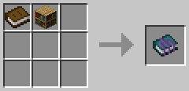

# Eccentric Tome

This mod adds a single item: the Eccentric Tome.

The Tome solves a single problem: managing all of your guide books.

The Tome allows many (infinite?) books to be combined into a single item, and enables them to be retrieved when needed.

## Caution

**Single-use items added to the tome will still be single use!**

Items that vanish or break (such as Tome of Helmets or Galactic Tome) will cause
the Eccentric Tome to vanish or break along with all the books stored inside of it.

## Crafting

Craft the Tome in the crafting grid with a book and a bookcase

Craft the Tome with other books in the crafting grid to attach them

## Controls

`Right-Click` while holding Tome to open the book selection screen

`Shift` + `Right-Click` while holding Tome to convert to the book for the block you're looking at

`Left-Click` on air to revert a book back into the Tome

`Shift` + `Q` while holding the converted tome to eject a book from it

## Credits

Vazkii for the original idea

## Frequently asked questions

**Question:** Why rewrite Akashic Tome?

**Answer:** This mod was originally created was because the maintainers of Akashic Tome released it
for 1.18.1 in a broken state without any testing. I was able to fix it within a few minutes
(the fix was two lines of code) and I opened a pull request. My pull request was ignored for almost a month.
So, I closed the pull request and created this mod.

This mod differs from Akashic Tome in that it actually works for 1.18.1 and it does not require AutoRegLib.
Additionally, Vazkii also hasn't put a license on the Github repository for Akashic Tome, which means that
it's "all rights reserved". I personally disagree with that choice, so I rewrote the Eccentric Tome from
scratch and licensed it under the AGPL so that people can copy and learn from it.
